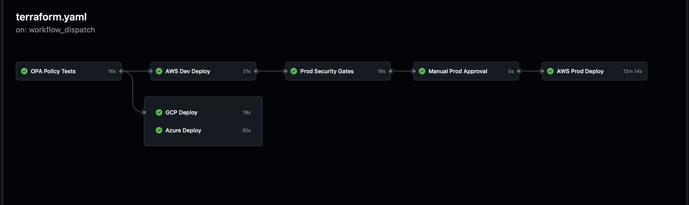
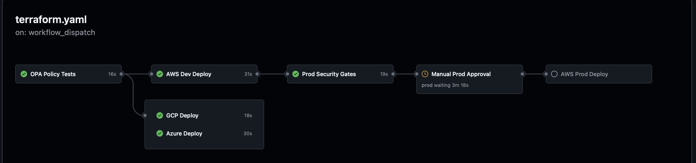
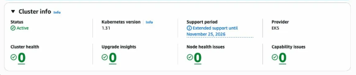

# GitOps Infrastructure Pipeline

## Overview

Event-driven GitOps pipeline that provisions multi-cloud infrastructure using GitHub Actions, Terraform, and Kargo progressive delivery. Features OPA policy gates, Trivy security scanning, S3 remote state with DynamoDB locking, multi-environment promotion with manual approval gates, multi-channel Slack notifications, and OIDC authentication eliminating all long-lived credentials.

AWS deploys fully across dev and prod environments via Kargo promotion. Prod deployments require passing Trivy and OPA security gates plus manual approval before any infrastructure changes are applied. GCP and Azure run the complete security gate pipeline on every commit with infrastructure scaffolded and ready to activate.

## Architecture
```
Git Commit → Main
        ↓
Kargo Warehouse detects change → generates Freight
        ↓
Promote to Dev
        ↓
GitHub Actions (workflow_dispatch)
        ↓
OPA Policy Tests (AWS + GCP)
        ├── tags.rego       - all resources must have managed-by and environment tags
        ├── network.rego    - no SSH open to 0.0.0.0/0 across all clouds
        └── compute.rego    - approved instance types only per cloud
        ↓
Parallel Jobs
        ├── AWS Dev Deploy
        │     ├── OIDC Authentication → AWS IAM Role (temporary credentials)
        │     ├── fmt → validate → TFLint → Trivy (soft fail)
        │     ├── Terraform Init → S3 backend (DynamoDB state locking)
        │     ├── Terraform Plan + Apply
        │     │     ├── VPC + Subnets (public + private) + IGW + NAT Gateway
        │     │     ├── EC2 t2.micro (Amazon Linux 2)
        │     │     └── EKS 1.35 Cluster + Managed Node Group (t3.medium)
        │     ├── Capture Outputs (Instance ID, Public IP, Cluster Name, Endpoint)
        │     └── Slack Notifications
        │
        ├── GCP Deploy
        │     ├── fmt → validate → TFLint → Trivy
        │     ├── Terraform Plan (apply disabled - credentials pending)
        │     │     └── VPC + Subnet + Firewall + GKE + e2-micro VM (count = 0)
        │     └── Slack Notifications
        │
        └── Azure Deploy
              ├── fmt → validate → TFLint → Trivy
              ├── Terraform Plan (skipped - credentials required)
              │     └── Resource Group + VNet + NSG + AKS + Standard_B1s VM (count = 0)
              └── Slack Notifications
        ↓
Promote to Prod (manual Kargo promotion)
        ↓
Prod Security Gates
        ├── Trivy IaC Scan (exit-code 1 — hard fail on HIGH/CRITICAL)
        └── OPA Policy Tests
        ↓
Manual Approval Gate (GitHub Environments — required reviewer + 5 min wait timer)
        ↓
AWS Prod Deploy
        ├── Terraform Init → S3 backend (separate prod state key)
        ├── Terraform Plan + Apply
        │     ├── VPC + Subnets + IGW + NAT Gateway
        │     ├── EC2 (IMDSv2 required, encrypted root volume)
        │     └── EKS 1.35 (private endpoint, secret encryption, restricted CIDR)
        └── Slack Notifications

All Jobs → #infra-audit (always)
```

## Components

**Kargo Promotion Pipeline** manages progressive delivery across environments. The Warehouse watches the main branch for new commits and generates Freight. Promoting Freight to dev triggers the GitHub Actions pipeline. Only after dev succeeds is Freight eligible for prod promotion. Prod promotion triggers a separate workflow with `deploy_prod=yes` which activates the security gates and manual approval flow.

**OPA Policy Gates** run before all cloud deployments using Conftest and custom Rego policies. Unlike Trivy which checks against a vendor-maintained ruleset, OPA enforces organizational policies like required tags, no open SSH, and approved instance types per cloud.

**GitHub Actions** orchestrates parallel cloud jobs triggered via Kargo's HTTP promotion step calling the GitHub API. `workflow_dispatch` only so nothing triggers automatically.

**OIDC Authentication** eliminates long-lived credentials entirely. GitHub Actions requests a JWT token, AWS validates it originated from this specific repository, and assumes the designated IAM role for temporary scoped access.

**S3 Remote State + DynamoDB Locking**  Dev and prod maintain separate state files in the same S3 bucket (`aws/dev/terraform.tfstate` and `aws/prod/terraform.tfstate`). DynamoDB prevents concurrent pipeline runs from corrupting state.

**Terraform** provisions all infrastructure per cloud and environment. Dev uses relaxed security settings for demo purposes. Prod enforces hardened configuration, private EKS endpoints, secret encryption, IMDSv2, encrypted volumes, and restricted CIDR ranges. Trivy hard-fails on prod if any HIGH or CRITICAL misconfigurations are detected.

**Security Pipeline Gates** run on all three clouds:
- `terraform fmt` enforces consistent code formatting
- `terraform validate` catches syntax errors before plan
- `TFLint` identifies cloud-provider-specific issues
- `Trivy` detects HIGH and CRITICAL misconfigurations (soft fail on dev, hard fail on prod)

**Multi-Channel Slack Notifications** provide real-time visibility:
- `#infra-deployments` - successful deployments with resource details
- `#infra-alerts` - failures with direct link to the failed run
- `#infra-audit` - every run regardless of outcome

## Repository Structure
```
gitops-infra-pipeline/
├── .github/
│   └── workflows/
│       └── terraform.yaml         # OPA gate + parallel cloud jobs + prod gates + approval
├── kargo/
│   ├── project.yaml               # Kargo project definition
│   ├── warehouse.yaml             # Git warehouse watching main branch
│   ├── stages.yaml                # Dev and prod stages with promotion templates
│   └── secret.yaml                # GitHub PAT secret (not committed)
├── policy/
│   ├── tags.rego                  # Required tag enforcement
│   ├── network.rego               # No open SSH across all clouds
│   └── compute.rego               # Approved instance types per cloud
├── terraform/
│   ├── aws/
│   │   ├── dev/
│   │   │   ├── main.tf            # Security group, EC2
│   │   │   ├── network.tf         # VPC, subnets, IGW, NAT gateway, route tables
│   │   │   ├── eks.tf             # EKS cluster, node group, IAM roles
│   │   │   ├── backend.tf         # S3 backend (aws/dev/terraform.tfstate)
│   │   │   ├── variables.tf
│   │   │   ├── outputs.tf
│   │   │   └── providers.tf
│   │   └── prod/
│   │       ├── main.tf            # Hardened security group, EC2 (IMDSv2, encrypted)
│   │       ├── network.tf         # VPC, subnets (no public IP), IGW, NAT
│   │       ├── eks.tf             # EKS (private endpoint, secret encryption)
│   │       ├── backend.tf         # S3 backend (aws/prod/terraform.tfstate)
│   │       ├── variables.tf
│   │       ├── outputs.tf
│   │       └── providers.tf
│   ├── gcp/
│   │   ├── main.tf                # Compute instance
│   │   ├── network.tf             # VPC, subnet, firewall
│   │   ├── gke.tf                 # GKE cluster, node pool, IAM
│   │   ├── variables.tf
│   │   ├── outputs.tf
│   │   └── provider.tf
│   └── azure/
│       ├── main.tf                # Resource group, Linux VM
│       ├── network.tf             # VNet, subnet, NSG, NIC
│       ├── aks.tf                 # AKS cluster, identity
│       ├── variables.tf
│       ├── outputs.tf
│       └── provider.tf
├── screenshots/
├── .gitignore
└── README.md
```

## Prerequisites

### AWS (active)
- AWS account with IAM role configured for GitHub OIDC
- S3 bucket `gitops-infra-pipeline-tfstate` with versioning enabled
- DynamoDB table `gitops-infra-pipeline-tflock` (partition key: `LockID`)
- GitHub repository secrets:
  - `AWS_ROLE_ARN`
  - `SLACK_WEBHOOK_DEPLOYMENTS`
  - `SLACK_WEBHOOK_ALERTS`
  - `SLACK_WEBHOOK_AUDIT`

### Kargo (local kind cluster)
- kind cluster running
- cert-manager installed
- Kargo v1.9.5 installed
- GitHub PAT with `workflow` scope stored as cluster secret

### GCP (scaffolded - apply disabled)
- GCP account with Workload Identity Federation configured
- GitHub repository secrets when ready to activate:
  - `GCP_WORKLOAD_IDENTITY_PROVIDER`
  - `GCP_SERVICE_ACCOUNT`

### Azure (scaffolded - plan disabled)
- Azure account with federated credentials configured
- GitHub repository secrets when ready to activate:
  - `AZURE_CLIENT_ID`
  - `AZURE_TENANT_ID`
  - `AZURE_SUBSCRIPTION_ID`
  - `AZURE_SSH_PUBLIC_KEY`

## Setup

### 1. Bootstrap S3 State Backend
```bash
aws s3api create-bucket --bucket YOUR-TFSTATE-BUCKET-NAME --region us-east-1
aws s3api put-bucket-versioning --bucket YOUR-TFSTATE-BUCKET-NAME \
  --versioning-configuration Status=Enabled
aws dynamodb create-table --table-name YOUR-TFLOCK-TABLE-NAME \
  --attribute-definitions AttributeName=LockID,AttributeType=S \
  --key-schema AttributeName=LockID,KeyType=HASH \
  --billing-mode PAY_PER_REQUEST
```

### 2. Configure GitHub OIDC in AWS

Create an IAM OIDC Identity Provider:
```
Provider URL: https://token.actions.githubusercontent.com
Audience: sts.amazonaws.com
```

Create an IAM Role with this trust policy:
```json
{
  "Version": "2012-10-17",
  "Statement": [
    {
      "Effect": "Allow",
      "Principal": {
        "Federated": "arn:aws:iam::YOUR_ACCOUNT_ID:oidc-provider/token.actions.githubusercontent.com"
      },
      "Action": "sts:AssumeRoleWithWebIdentity",
      "Condition": {
        "StringEquals": {
          "token.actions.githubusercontent.com:aud": "sts.amazonaws.com"
        },
        "StringLike": {
          "token.actions.githubusercontent.com:sub": "repo:YOUR_GITHUB_USERNAME/gitops-infra-pipeline:*"
        }
      }
    }
  ]
}
```

Create four scoped inline policies: eks_access, ec2_vpc, SecretsManager, tfbacknstate.
See the policy definitions in the repository for the specific actions required.
No AWS managed FullAccess policies are used.

### 3. Install Kargo
```bash
# Install cert-manager
kubectl apply -f https://github.com/cert-manager/cert-manager/releases/download/v1.14.0/cert-manager.yaml

# Generate password hash
docker run --rm httpd:2 htpasswd -bnBC 10 "" yourpassword | tr -d ':\n'

# Install Kargo
helm install kargo \
  oci://ghcr.io/akuity/kargo-charts/kargo \
  --namespace kargo \
  --create-namespace \
  --set api.adminAccount.passwordHash='<hash>' \
  --set api.adminAccount.tokenSigningKey=<yourpassword> \
  --set controller.argocd.integrationEnabled=false \
  --wait

# Apply Kargo resources
kubectl apply -f kargo/project.yaml
kubectl apply -f kargo/warehouse.yaml
kubectl apply -f kargo/stages.yaml

# Create GitHub PAT secret (workflow scope required)
kubectl create secret generic githubpat \
  --namespace gitops-infra \
  --from-literal=token=<your-github-pat>
kubectl label secret githubpat -n gitops-infra kargo.akuity.io/cred-type=generic
```

### 4. Configure GitHub Environments

In repository Settings → Environments create:
 `dev` - no protection rules
 `prod` - required reviewer + 5 minute wait timer

### 5. Deploy
```bash
# Port-forward Kargo
kubectl port-forward --namespace kargo svc/kargo-api 3100:443 &
kargo login https://localhost:3100 --admin --insecure-skip-tls-verify

# Get latest freight
kargo get freight --project gitops-infra

# Promote to dev
kargo promote --project gitops-infra --freight <hash> --stage dev

# After dev succeeds, promote to prod
kargo promote --project gitops-infra --freight <hash> --stage prod
# Then approve in GitHub Actions → Environments → prod
```

### 6. Manual Teardown (AWS)
```bash
# Delete in this order to avoid dependency errors
# EKS prod → EKS dev → EC2 → VPC → EIP
```

1. EKS → Clusters → delete node group → wait → delete cluster (repeat for dev and prod)
2. EC2 → Instances → Terminate
3. VPC → Delete VPC (removes subnets, IGW, route tables)
4. EC2 → Elastic IPs → release unattached EIP

### 7. Enabling GCP Apply

1. Configure Workload Identity Federation in GCP
2. Add `GCP_WORKLOAD_IDENTITY_PROVIDER` and `GCP_SERVICE_ACCOUNT` secrets to GitHub
3. Uncomment the auth step in `deploy-gcp` job in `terraform.yaml`
4. Set `deploy = true` on plan/apply steps

### 8. Enabling Azure Apply

1. Create a service principal with federated credentials in Azure
2. Add `AZURE_CLIENT_ID`, `AZURE_TENANT_ID`, `AZURE_SUBSCRIPTION_ID`, `AZURE_SSH_PUBLIC_KEY` to GitHub
3. Uncomment the auth step in `deploy-azure` job
4. Remove `continue-on-error: true` from the Azure plan step

## Screenshots

### Full Pipeline - Dev to Prod with Security Gates and Manual Approval


### Manual Prod Approval Gate


### Pipeline Flow - OPA Gates + Parallel Cloud Deploys


### Slack Audit Log


### AWS EKS Console


## Design Decisions

**Why Kargo for promotion instead of just GitHub Actions?**
GitHub Actions can deploy but has no concept of promotion policy so nothing prevents someone from deploying directly to prod without going through dev. Kargo enforces the promotion chain: freight must pass through dev before it's eligible for prod. It also decouples the trigger mechanism from the deployment pipeline, which is the correct separation of concerns.

**Why hard-fail Trivy on prod but soft-fail on dev?**
Dev is intentionally permissive  (open SSH, public IPs, no encryption)  to keep the demo simple and cheap. Prod enforces real security standards. The Trivy gate catches the delta between environments and blocks anything that doesn't meet prod requirements. This is the security gate proving itself: it caught real misconfigurations (public subnet auto-assignment, unencrypted volumes, open security groups) and blocked the deployment until they were fixed.

**Why scoped inline policies instead of AWS managed FullAccess policies?**
The pipeline initially used AmazonEC2FullAccess and AmazonVPCFullAccess for simplicity. These were replaced with four scoped inline policies (eks_access, ec2_vpc, SecretsManager, tfbacknstate) that grant only the specific actions this pipeline requires. IAM PassRole and CreateRole are scoped to the `gitops-infra-*` role name prefix. This follows least-privilege and reduces blast radius if the OIDC role is ever compromised.

**Why separate dev and prod Terraform directories instead of workspaces?**
Workspaces share the same configuration with variable overrides. Separate directories make the security delta between dev and prod explicit and reviewable meaning a PR touching `terraform/aws/prod` is clearly a prod change, not an ambiguous workspace switch.

**Why S3 backend with DynamoDB locking?**
Without remote state, Terraform has no memory of previous deployments. Two pipeline runs triggered simultaneously would corrupt state. S3 provides shared state, versioning for rollback, and DynamoDB provides distributed locking to prevent concurrent applies.

**Why OPA/Conftest over just Trivy?**
Trivy scans against a fixed vendor-maintained ruleset. OPA enforces organizational policies you define. The two tools complement each other: Trivy catches known misconfigurations, OPA enforces your own standards.

**Why OIDC over long-lived access keys?**
Long-lived credentials stored in GitHub secrets are a security liability. OIDC provides temporary scoped credentials valid only for the duration of the workflow run, scoped to this specific repository. Eliminates credential exposure risk entirely.

**Why no automated destroy workflow?**
This is a public repository. An automated destroy workflow accessible via `workflow_dispatch` creates an unnecessary attack surface. In a private repository with branch protection and required reviewers, an automated destroy workflow is appropriate.

**Why `deploy = false` for GCP and Azure?**
Running the full security gate pipeline on all three clouds on every commit keeps the code honest. Syntax errors and policy violations get caught immediately even without active accounts. The code stays tested and ready to activate.

## Troubleshooting

**Kargo promotion fails with secret error**
Verify the GitHub PAT secret has `workflow` scope and is labeled `kargo.akuity.io/cred-type=generic`. Classic tokens work more reliably than fine-grained tokens for `workflow_dispatch` API calls.

**Terraform init fails with S3 credentials error in OPA job**
The OPA job removes `backend.tf` before init and uses mock credentials. If this step fails verify the `rm -f backend.tf` command runs before `terraform init` in the policy-test job.

**Trivy hard-fails on prod**
This is expected behavior because prod has `exit-code: 1`. Fix the misconfiguration in `terraform/aws/prod`, push, and re-promote. Common prod findings: `map_public_ip_on_launch = true`, open security group CIDRs, unencrypted volumes, missing IMDSv2.

**OIDC authentication fails**
Verify the trust policy `sub` condition matches your exact GitHub username and repository name. Format must be `repo:USERNAME/REPOSITORY:*`.

**DynamoDB lock not released**
If a pipeline run is cancelled mid-apply, the DynamoDB lock may not release. Manually delete the lock item from the `gitops-infra-pipeline-tflock` table in the AWS console.

**VPC limit exceeded**
AWS default limit is 5 VPCs per region. Without state, previous runs may have left VPCs behind. Delete unused VPCs before redeploying.

**Resources already exist on redeploy**
Terraform state is in S3. If resources exist in state and in AWS they will be updated in place. If resources exist in AWS but not in state (orphaned), delete them manually before applying.

## Part of a Platform Engineering Portfolio

- **Project 1** - [Argo Events CI/CD Pipeline](https://github.com/SmartBrisco/argo-event-pipeline) - Event-driven CI/CD with AI-powered failure analysis
- **Project 2** - GitOps Infrastructure Pipeline (this project) - Multi-cloud Terraform with Kargo progressive delivery, security gates, and manual approval across AWS, GCP, and Azure
- **Project 3** - [Platform Observability Stack](https://github.com/SmartBrisco/platform-observability) - Unified observability with OpenTelemetry, Jaeger, Prometheus, and Grafana
- **Project 4** - [Namespace Provisioner](https://github.com/SmartBrisco/namespace-provisioner) - Kubernetes operator in Go for policy-enforced namespace provisioning
- **Bootstrap** - [Platform](https://github.com/SmartBrisco/Platform) - One command to spin up the full platform locally