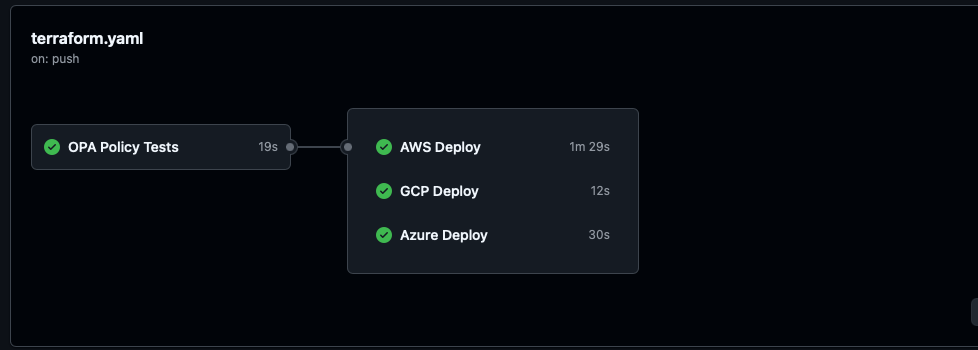
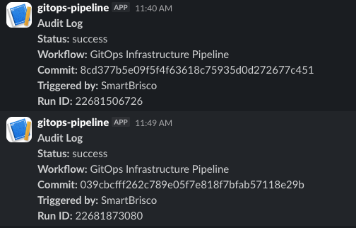
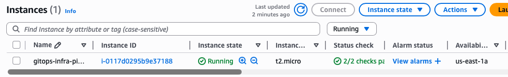

# GitOps Infrastructure Pipeline

## Overview

Event-driven GitOps pipeline that automatically provisions AWS infrastructure on every commit to `main` using GitHub Actions and Terraform. Features multi-channel Slack notifications for deployment success, failure, and full audit logging with OIDC authentication eliminating all long-lived AWS credentials.

## Architecture

```
Git Push to Main
        ↓
GitHub Actions Trigger
        ↓
OIDC Authentication → AWS IAM Role (temporary credentials)
        ↓
Terraform Format Check → Validate → TFLint → Trivy IaC Scan
        ↓
Terraform Plan
        ↓
Terraform Apply
        ├── VPC + Subnet + Internet Gateway + Route Table
        └── EC2 t2.micro (Amazon Linux 2)
        ↓
Capture Outputs (Instance ID, Public IP, State)
        ↓
Slack Notifications
        ├── #infra-deployments (success)
        ├── #infra-alerts (failure)
        └── #infra-audit (always)
```

## Components

**GitHub Actions** orchestrates the entire pipeline. Triggered on every push to `main` or manual dispatch via `workflow_dispatch`. Changes to Terraform files only trigger infrastructure deployment — README and workflow updates do not cause unnecessary deploys.

**OIDC Authentication** eliminates long-lived AWS credentials entirely. GitHub Actions requests a JWT token, AWS validates it originated from this specific repository, and assumes the designated IAM role for temporary scoped access. No secrets stored in GitHub beyond the role ARN.

**Terraform** provisions all infrastructure from scratch — VPC, subnet, internet gateway, route table, security group, and EC2 instance. No dependency on default VPC or pre-existing account resources.

**Security Pipeline Gates** run before any infrastructure changes:
- `terraform fmt` enforces consistent code formatting
- `terraform validate` catches syntax errors before plan
- TFLint identifies AWS-specific issues and deprecated patterns
- Trivy IaC scanning detects HIGH and CRITICAL misconfigurations

**Multi-Channel Slack Notifications** provide real-time visibility:
- Success deployments post to `#infra-deployments` with instance details
- Failures post to `#infra-alerts` with direct link to the failed run
- Every run posts to `#infra-audit` regardless of outcome — complete audit trail

**AWS Secrets Manager** stores all sensitive values. No credentials hardcoded anywhere in the codebase.

## Repository Structure

```
gitops-infra-pipeline/
├── .github/
│   └── workflows/
│       └── terraform.yml      # Deploy pipeline
├── terraform/
│   ├── main.tf                # VPC, subnet, security group, EC2
│   ├── variables.tf           # Input variables
│   ├── outputs.tf             # Instance ID, public IP, state
│   └── provider.tf            # AWS provider and Terraform version
└── README.md
```

## Prerequisites

- AWS account with IAM role configured for GitHub OIDC
- GitHub repository secrets:
  - `AWS_ROLE_ARN`
  - `SLACK_WEBHOOK_DEPLOYMENTS`
  - `SLACK_WEBHOOK_ALERTS`
  - `SLACK_WEBHOOK_AUDIT`
- Slack workspace with three channels and incoming webhooks configured

## Setup

### 1. Configure GitHub OIDC in AWS

Create an IAM OIDC Identity Provider:
```
Provider URL: https://token.actions.githubusercontent.com
Audience: sts.amazonaws.com
```

Create an IAM Role with this trust policy:
```json
{
  "Version": "2012-10-17",
  "Statement": [
    {
      "Effect": "Allow",
      "Principal": {
        "Federated": "arn:aws:iam::YOUR_ACCOUNT_ID:oidc-provider/token.actions.githubusercontent.com"
      },
      "Action": "sts:AssumeRoleWithWebIdentity",
      "Condition": {
        "StringEquals": {
          "token.actions.githubusercontent.com:aud": "sts.amazonaws.com"
        },
        "StringLike": {
          "token.actions.githubusercontent.com:sub": "repo:YOUR_GITHUB_USERNAME/gitops-infra-pipeline:*"
        }
      }
    }
  ]
}
```

Attach policies: `AmazonEC2FullAccess`, `AmazonVPCFullAccess`, `SecretsManagerReadWrite`

### 2. Configure Slack

Create a Slack app at api.slack.com/apps. Enable Incoming Webhooks. Create three webhooks pointing to:
- `#infra-deployments`
- `#infra-alerts`
- `#infra-audit`

### 3. Add GitHub Secrets

Add to repository Settings → Secrets and variables → Actions:
- `AWS_ROLE_ARN` — ARN of the IAM role created above
- `SLACK_WEBHOOK_DEPLOYMENTS` — webhook URL for deployments channel
- `SLACK_WEBHOOK_ALERTS` — webhook URL for alerts channel
- `SLACK_WEBHOOK_AUDIT` — webhook URL for audit channel

### 4. Deploy

Push any commit to `main` with changes in the `terraform/` directory:
```bash
git add .
git commit -m "feat: trigger infrastructure deployment"
git push origin main
```

Or use AWS console — terminate instance first, then delete VPC which removes all associated resources simultaneously.

## Screenshots

### Successful Pipeline Run


### Slack Audit Log


### AWS EC2 Console



### 5. Manual Teardown

This is a public repository. Automated destroy workflows are not included for security reasons — see Design Decisions below. To destroy all resources manually:


### 5. Manual Teardown

1. EC2 → Instances → select instance → Instance State → Terminate. Wait for terminated status.
2. VPC → Your VPCs → select `gitops-infra-pipeline-vpc` → Actions → Delete VPC. AWS removes all associated resources automatically.


## Design Decisions

**Why GitHub Actions over Jenkins?**
Native Git integration with zero infrastructure to maintain. Every engineer already has access through the repository so no separate credentials or server required. Industry standard for modern GitOps workflows.

**Why OIDC over long-lived access keys?**
Long-lived AWS credentials stored in GitHub secrets are a security liability. OIDC provides temporary scoped credentials valid only for the duration of the workflow run, scoped to this specific repository. Eliminates an entire category of credential exposure risk.

**Why build VPC and subnet explicitly rather than use defaults?**
Building all networking infrastructure explicitly in Terraform ensures consistent, reproducible deployments regardless of account state. Every resource is tagged, tracked, and managed.

**Why three Slack channels?**
Operational signal separation. Success notifications in `#infra-deployments` and human readable. `#infra-alerts` can be configured for on-call paging without noise from successful runs. `#infra-audit` provides a complete searchable audit trail for compliance and incident investigation (every deployment logged regardless of outcome).

**Why soft_fail on Trivy?**
The SSH ingress rule is intentionally open for demonstration purposes. In production this would be restricted to known CIDR ranges and `exit-code` would be set to `1`, blocking any deployment with HIGH or CRITICAL findings.

**Why no automated destroy workflow?**
This is a public repository. An automated destroy workflow accessible via `workflow_dispatch` in a public repo creates an unnecessary attack surface — any authenticated GitHub user could potentially trigger infrastructure destruction. Infrastructure teardown is handled manually via AWS CLI or console.

In a private repository with proper branch protection, required reviewers, and environment gates configured, an automated destroy workflow would be appropriate and is recommended for production use. 

**Why no Terraform remote state backend?**
For a public portfolio repository, storing Terraform state in S3 requires exposing bucket names and potentially sensitive state data. In production, remote state with S3 backend and DynamoDB locking is required for team environments

State locking via DynamoDB prevents concurrent pipeline runs from corrupting the state file.

## Troubleshooting

**OIDC authentication fails**
Verify the trust policy `sub` condition matches your exact GitHub username and repository name. Format must be `repo:USERNAME/REPOSITORY:*` with a colon before the wildcard not a slash.

**Terraform fmt check fails**
Run `terraform fmt -recursive` locally before pushing. The pipeline enforces consistent formatting — unformatted code fails the check.

**Pipeline triggers on every push**
Verify path filtering is configured in terraform.yml. Only commits touching files in `terraform/` should trigger infrastructure deployment.

**Slack notifications not firing**
Confirm webhook URLs are stored correctly in GitHub secrets with no trailing spaces or quotes. Test webhooks directly with curl before pushing. Verify the `env` block references the correct secret name.

**Resources already exist on redeploy**
Without remote state backend, Terraform has no memory of previous deployments. Clean up existing resources manually before redeploying. See Manual Teardown section above.


## Part of a Three-Project Platform Engineering Portfolio complete with makefile for fast deployment

- **Project 1** — [Argo Events CI/CD Pipeline](https://github.com/SmartBrisco/argo-event-pipeline) — Event-driven application pipeline with AI-powered failure analysis
- **Project 2** — GitOps Infrastructure Pipeline (this project) — GitHub Actions and Terraform infrastructure automation
- **Project 3** — [Platform Observability Stack](https://github.com/SmartBrisco/platform-observability) — Unified observability with OpenTelemetry, Jaeger, Prometheus, and Grafana
- **Bootstrap** — [Platform](https://github.com/SmartBrisco/Platform) — One command to spin up the full platform locally in under 10 minutes